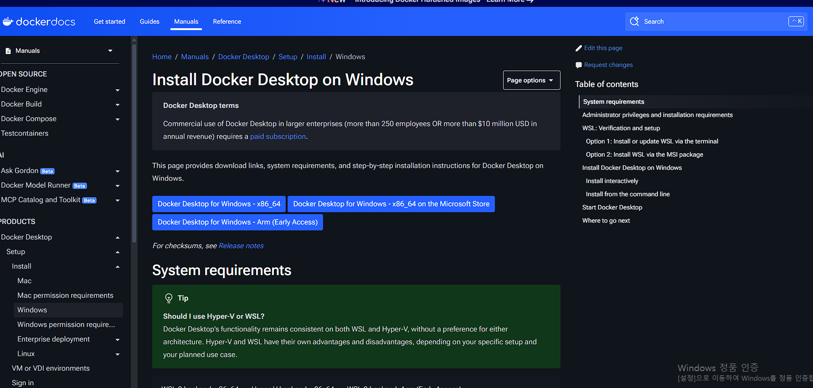

# Docker 설치

## Docker 설치 가이드
- https://docs.docker.com/install/

## Windows용 Docker Desktop
- https://docs.docker.com/docker-for-windows/

## Mac용 Docker Desktop
- https://docs.docker.com/docker-for-mac/

### Mac에서 Docker Desktop 문제 해결 (osxkeychain)
- Mac에서 **osxkeychain** 관련 문제가 발생할 수 있습니다.
- 아래 단계를 따라 해결합니다.
- **사전 참고 자료:**
  - https://medium.com/@dakshika/error-creating-the-docker-image-on-macos-wso2-enterprise-integrator-tooling-dfb5b537b44e

**Step 1: Docker Desktop 설정 변경**
- Docker Desktop → Preferences를 엽니다.
- **Securely store Docker logins in macOS keychain** 옵션을 해제합니다.

**Step 2: config.json 수정**
- **.docker** 폴더의 **config.json** 파일을 엽니다.
- 예시 경로:
  - /Users/<userid>/.docker/config.json
  - ~/.docker/config.json
- config.json에서 **"credSstore": "osxkeychain"** 라인을 제거합니다.
