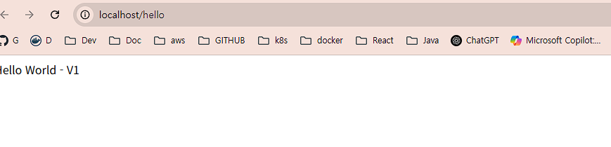
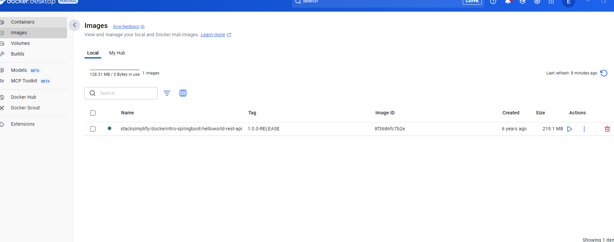
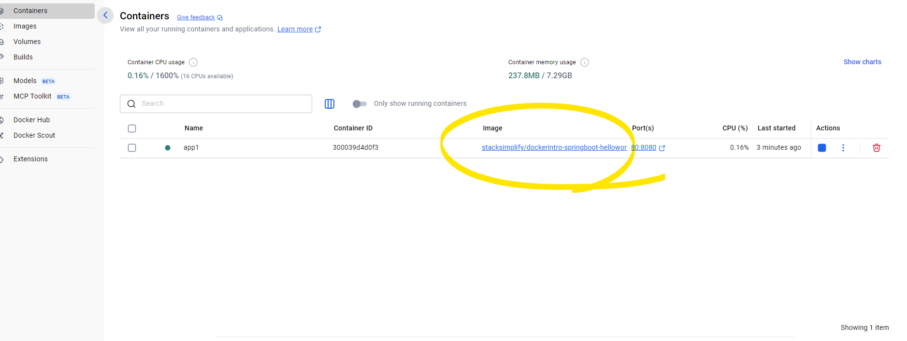
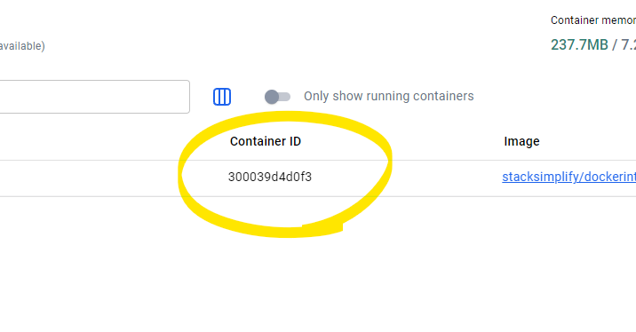
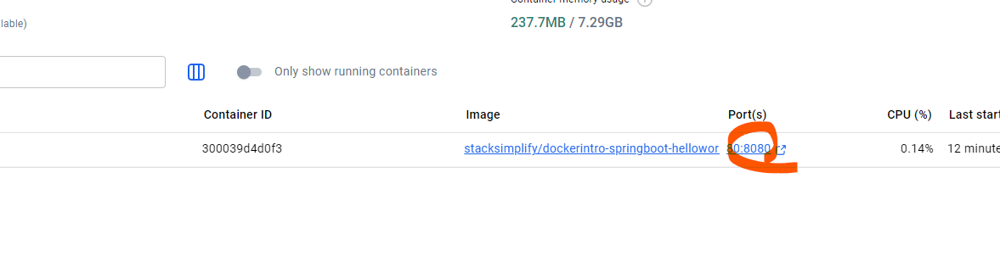
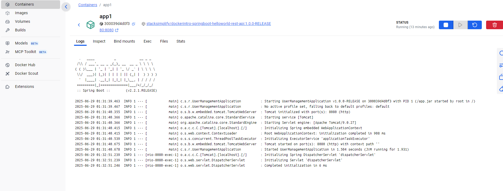

# 흐름-1: Docker Hub에서 이미지 내려받아 실행

## 1. Docker 버전 확인 및 Docker Hub 로그인
```bash
docker version
docker login
```

## 2. Docker Hub에서 이미지 Pull
```bash
docker pull stacksimplify/dockerintro-springboot-helloworld-rest-api:1.0.0-RELEASE
```

## 3. 이미지 실행 및 애플리케이션 접속
- Docker Hub에서 이미지 이름을 복사해 실행합니다.
```bash
docker run --name app1 -p 80:8080 -d stacksimplify/dockerintro-springboot-helloworld-rest-api:1.0.0-RELEASE
```

### 이미지 목록 확인
```bash
docker image ls
```

### 브라우저 접속
- http://localhost/hello




## 참고: Apple Silicon(Mac) 환경
1. Apple Silicon용 Docker Desktop을 설치합니다.
   - https://docs.docker.com/desktop/mac/install/
2. 아래 명령으로 Nginx 컨테이너를 실행합니다.

```bash
docker run --name kube1 -p 80:80 --platform linux/amd64 -d stacksimplify/kubenginx:1.0.0
```

- http://localhost

### 예시 출력
```text
kalyanreddy@Kalyans-Mac-mini-2 ~ % docker run --name kube1 -p 80:80 --platform linux/amd64 -d  stacksimplify/kubenginx:1.0.0
370f238d97556813a4978572d24983d6aaf80d4300828a57f27cda3d3d8f0fec
kalyanreddy@Kalyans-Mac-mini-2 ~ % curl http://localhost
<!DOCTYPE html>
<html>
   <body style="background-color:lightgoldenrodyellow;">
      <h1>Welcome to Stack Simplify</h1>
      <p>Kubernetes Fundamentals Demo</p>
      <p>Application Version: V1</p>
   </body>
</html>%
kalyanreddy@Kalyans-Mac-mini-2 ~ %
```

## 4. 실행 중인 컨테이너 목록 확인
```bash
docker ps
docker ps -a
docker ps -a -q
```

### Docker Desktop 목록 확인(동일 내용)


## 5. 컨테이너 터미널 접속
```bash
docker exec -it <container-name> /bin/sh
```



### 예시
```text
PS C:\edumgt-java-education\docker-fundamentals> docker exec -it app1 /bin/sh
/ # ls -al
total 18840
drwxr-xr-x    1 root     root          4096 Jun 29 01:31 .
drwxr-xr-x    1 root     root          4096 Jun 29 01:31 ..
-rwxr-xr-x    1 root     root             0 Jun 29 01:31 .dockerenv
-rw-r--r--    1 root     root      19225249 Nov 23  2019 app.jar
drwxr-xr-x    2 root     root          4096 May  9  2019 bin
drwxr-xr-x    5 root     root           340 Jun 29 01:31 dev
drwxr-xr-x    1 root     root          4096 Jun 29 01:31 etc
drwxr-xr-x    2 root     root          4096 May  9  2019 home
drwxr-xr-x    1 root     root          4096 May 11  2019 lib
drwxr-xr-x    5 root     root          4096 May  9  2019 media
drwxr-xr-x    2 root     root          4096 May  9  2019 mnt
drwxr-xr-x    2 root     root          4096 May  9  2019 opt
dr-xr-xr-x  322 root     root             0 Jun 29 01:31 proc
drwx------    1 root     root          4096 Jun 29 01:36 root
drwxr-xr-x    2 root     root          4096 May  9  2019 run
drwxr-xr-x    2 root     root          4096 May  9  2019 sbin
drwxr-xr-x    2 root     root          4096 May  9  2019 srv
dr-xr-xr-x   13 root     root             0 Jun 29 01:31 sys
drwxrwxrwt    5 root     root          4096 Jun 29 01:31 tmp
drwxr-xr-x    1 root     root          4096 May 11  2019 usr
drwxr-xr-x    1 root     root          4096 May  9  2019 var
/ # exit
PS C:\edumgt-java-education\docker-fundamentals> docker exec -it 300039d4d0f39ce638d9678765d09ab92705c42544b6920f30f5e2c14890cfca /bin/sh
/ # ls -al
total 18840
drwxr-xr-x    1 root     root          4096 Jun 29 01:31 .
drwxr-xr-x    1 root     root          4096 Jun 29 01:31 ..
-rwxr-xr-x    1 root     root             0 Jun 29 01:31 .dockerenv
-rw-r--r--    1 root     root      19225249 Nov 23  2019 app.jar
drwxr-xr-x    2 root     root          4096 May  9  2019 bin
drwxr-xr-x    5 root     root           340 Jun 29 01:31 dev
drwxr-xr-x    1 root     root          4096 Jun 29 01:31 etc
drwxr-xr-x    2 root     root          4096 May  9  2019 home
drwxr-xr-x    1 root     root          4096 May 11  2019 lib
drwxr-xr-x    5 root     root          4096 May  9  2019 media
drwxr-xr-x    2 root     root          4096 May  9  2019 mnt
drwxr-xr-x    2 root     root          4096 May  9  2019 opt
dr-xr-xr-x  319 root     root             0 Jun 29 01:31 proc
drwx------    1 root     root          4096 Jun 29 01:36 root
drwxr-xr-x    2 root     root          4096 Jun 29 01:31 run
drwxr-xr-x    2 root     root          4096 Jun 29 01:31 sbin
drwxr-xr-x    2 root     root          4096 May  9  2019 srv
dr-xr-xr-x   13 root     root             0 Jun 29 01:31 sys
drwxrwxrwt    5 root     root          4096 Jun 29 01:31 tmp
drwxr-xr-x    1 root     root          4096 May 11  2019 usr
drwxr-xr-x    1 root     root          4096 May  9  2019 var
/ # exit
PS C:\edumgt-java-education\docker-fundamentals>
```

## 6. 컨테이너 중지 및 시작
```bash
docker stop <container-name>
docker start <container-name>
```

## 7. 컨테이너 삭제
```bash
docker stop <container-name>
docker rm <container-name>
```

## 8. 이미지 삭제
```bash
docker images
docker rmi <image-id>
```

## Docker Desktop에서 상태 확인

- `:` 클릭 → 상세 뷰 클릭


