# Flow-2: Create a new Docker Image, Run as Container and Push to Docker Hub

- **Dockerfile**
```
FROM nginx
COPY index.html /usr/share/nginx/html
```

## Dockerfile 이용
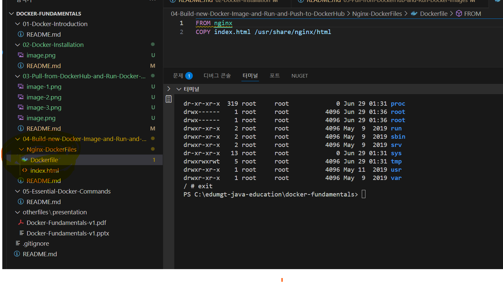
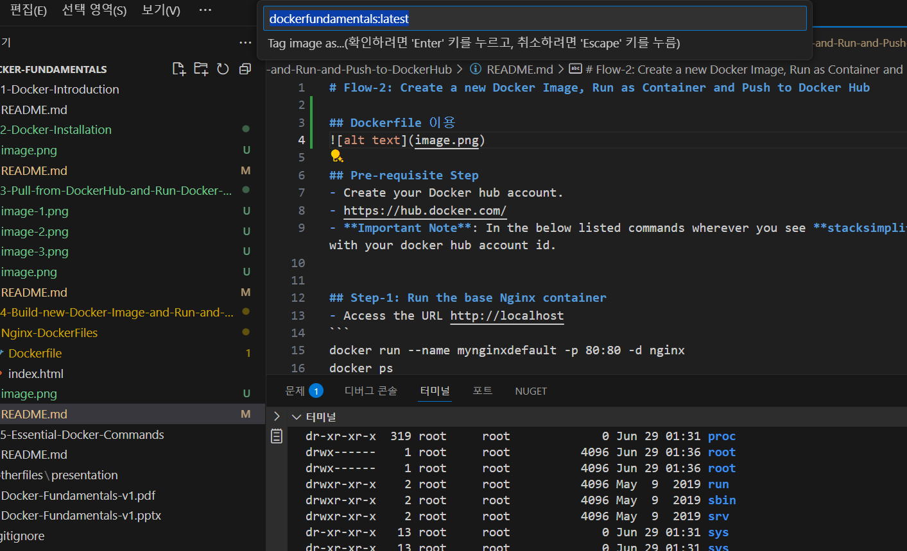
```
docker build --pull --rm -f '04-Build-new-Docker-Image-and-Run-and-Push-to-DockerHub\Nginx-DockerFiles\Dockerfile' -t 'dockerfundamentals:latest' '04-Build-new-Docker-Image-and-Run-and-Push-to-DockerHub\Nginx-DockerFiles' 

[+] Building 5.6s (7/7) FINISHED                                                                             docker:desktop-linux 
 => [internal] load build definition from Dockerfile                                                                         0.0s 
 => => transferring dockerfile: 86B                                                                                          0.0s 
 => [internal] load metadata for docker.io/library/nginx:latest                                                              0.8s 
 => [internal] load .dockerignore                                                                                            0.0s 
 => => transferring context: 2B                                                                                              0.0s 
 => [internal] load build context                                                                                            0.0s 
 => => transferring context: 90B                                                                                             0.0s 
 => [1/2] FROM docker.io/library/nginx:latest@sha256:dc53c8f25a10f9109190ed5b59bda2d707a3bde0e45857ce9e1efaa32ff9cbc1        4.1s 
 => => resolve docker.io/library/nginx:latest@sha256:dc53c8f25a10f9109190ed5b59bda2d707a3bde0e45857ce9e1efaa32ff9cbc1        0.0s 
 => => sha256:66467f8275465bcd2eb0ebdea7449b993fae35d16b8d57566c94aee34908a6ac 1.21kB / 1.21kB                               0.3s 
 => => sha256:397cc88dcd41f46e6d20c478796aef73525ea6e30086727d1716a27d0ce4b3d1 954B / 954B                                   0.4s 
 => => sha256:5f4a88bd8474bae2745ccd9541b8e83466e9ce661efb345676eed0834dce6494 405B / 405B                                   0.6s
 => => sha256:021db26e13de22f63471bd0c76a601fe3fbf691a9f7fd157bb79f35b1216cdc9 627B / 627B                                   0.6s
 => => sha256:4eb3a9835b30d43f28a1fcd1d85c9503ef59f655bbbe8b050ff0a3bd9a6d56c2 43.97MB / 43.97MB                             1.8s
 => => sha256:f05e870393313d21a5e3e06bbc4c3d934bbe6c73443959ca653f6394895dde87 1.40kB / 1.40kB                               0.2s
 => => sha256:dad67da3f26bce15939543965e09c4059533b025f707aad72ed3d3f3a09c66f8 28.23MB / 28.23MB                             1.5s
 => => extracting sha256:dad67da3f26bce15939543965e09c4059533b025f707aad72ed3d3f3a09c66f8                                    1.1s
 => => extracting sha256:4eb3a9835b30d43f28a1fcd1d85c9503ef59f655bbbe8b050ff0a3bd9a6d56c2                                    0.7s
 => => extracting sha256:021db26e13de22f63471bd0c76a601fe3fbf691a9f7fd157bb79f35b1216cdc9                                    0.0s
 => => extracting sha256:397cc88dcd41f46e6d20c478796aef73525ea6e30086727d1716a27d0ce4b3d1                                    0.0s
 => => extracting sha256:5f4a88bd8474bae2745ccd9541b8e83466e9ce661efb345676eed0834dce6494                                    0.0s
 => => extracting sha256:66467f8275465bcd2eb0ebdea7449b993fae35d16b8d57566c94aee34908a6ac                                    0.0s
 => => extracting sha256:f05e870393313d21a5e3e06bbc4c3d934bbe6c73443959ca653f6394895dde87                                    0.0s
 => [2/2] COPY index.html /usr/share/nginx/html                                                                              0.2s 
 => exporting to image                                                                                                       0.2s 
 => => exporting layers                                                                                                      0.1s 
 => => exporting manifest sha256:f67207e042d43a2c139bf3cbc84b3fdcd7cebd64953b3d7594317d8f032b1e74                            0.0s 
 => => exporting config sha256:e0af1d5828e645bfffb92ea5bf808d976252e7f74092235beae8b7dc9a83f917                              0.0s 
 => => exporting attestation manifest sha256:9de647b4f14caf82a0cdfea45b23eaf52892c7b036083d3e76bef8121c02b5c5                0.0s 
 => => exporting manifest list sha256:8eb2b6eabe726843f54d12427e31ae0d17c8fc12401a7654506b6a06269546c3                       0.0s 
 => => naming to docker.io/library/dockerfundamentals:latest                                                                 0.0s 
 => => unpacking to docker.io/library/dockerfundamentals:latest                                                              0.0s 

View build details: docker-desktop://dashboard/build/desktop-linux/desktop-linux/tmz3htjmmyp4fmlx4hpob8mtv
 *  터미널이 작업에서 다시 사용됩니다. 닫으려면 아무 키나 누르세요. 
```


## Pre-requisite Step
- Create your Docker hub account. 
- https://hub.docker.com/
- **Important Note**: In the below listed commands wherever you see **stacksimplify** you can replace with your docker hub account id. 

## Step-1: Run the base Nginx container
- Access the URL http://localhost
```
docker run --name app2 -p 80:80 -d dockerfundamentals
```
## Error
a0ce7121f6e72a2f3ef52ccbb5f2d25129d3ba99b33ab7cb5588498da2adda8e
docker: Error response from daemon: failed to set up container networking: driver failed programming external connectivity on endpoint app2 (b4d60879c5a8f93b637b659611c2ca2d5d7f694a3cc9849ca3d9c583bf0d4e6b): Bind for 0.0.0.0:80 failed: port is already allocated
## 위의 SpringBoot 컨테이너 실행 시 80 포트로 실행 하여 상호 충돌
## docker container 목록에는 이미 등록되어 있음
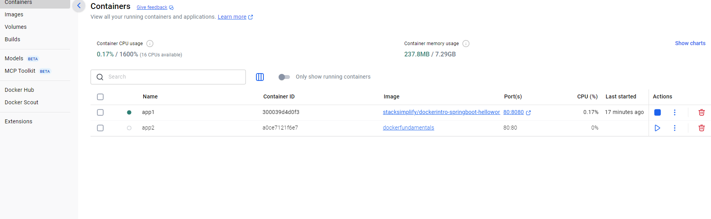
## docker run --name app2 -p 3000:80 -d dockerfundamentals
## Error
docker: Error response from daemon: Conflict. The container name "/app2" is already in use by container "a0ce7121f6e72a2f3ef52ccbb5f2d25129d3ba99b33ab7cb5588498da2adda8e". You have to remove (or rename) that container to be able to reuse that name.
## 이미 app2 동일 명으로 오류
## docker run --name app3 -p 3000:80 -d dockerfundamentals

## 재실행
PS C:\edumgt-java-education\docker-fundamentals> docker run --name app3 -p 3000:3000 -d dockerfundamentals
## 결과
b303748ea707199048037695107d917a6990cc5c11860b70ccbd16d504812026
## Docker DeskTop
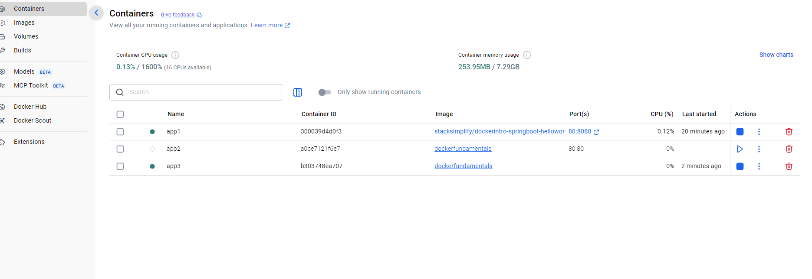
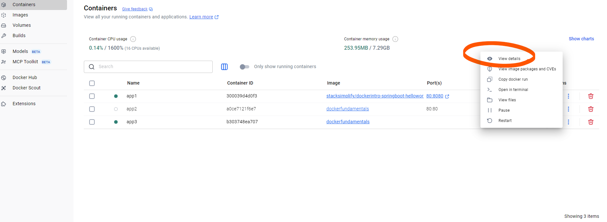

## docker 컨테이너 중지 및 이미지 삭제
```
docker ps
docker stop app2
docker stop app3

PS C:\edumgt-java-education\docker-fundamentals> docker rm a0ce7121f6e72a2f3ef52ccbb5f2d25129d3ba99b33ab7cb5588498da2adda8e
a0ce7121f6e72a2f3ef52ccbb5f2d25129d3ba99b33ab7cb5588498da2adda8e
PS C:\edumgt-java-education\docker-fundamentals> docker rm b303748ea707199048037695107d917a6990cc5c11860b70ccbd16d504812026
b303748ea707199048037695107d917a6990cc5c11860b70ccbd16d504812026

```
## 확인
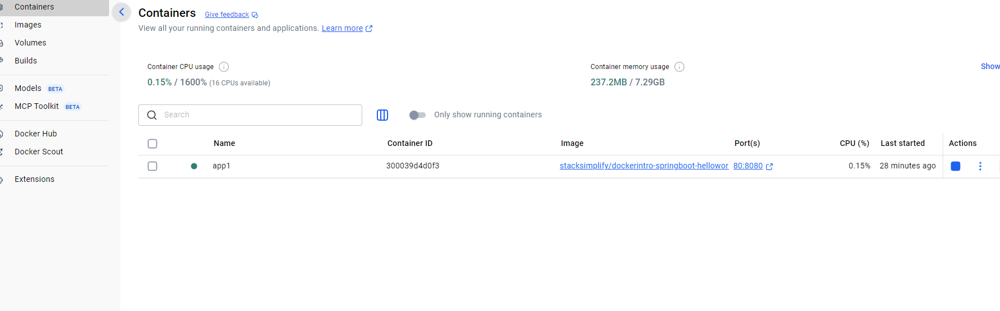

## docker rmi 8eb2b6eabe726843f54d12427e31ae0d17c8fc12401a7654506b6a06269546c3

## dockerfile build 다시 - 디렉토리 이동 후 index.html 복사 문제로 디렉토리 변경 필요
cd C:\edumgt-java-education\docker-fundamentals\04-Build-new-Docker-Image-and-Run-and-Push-to-DockerHub\Nginx-DockerFiles
실행 - docker build -t my-nginx .

## history 명령으로 그동안 실행 한 명령 목록 조회
## docker run --name app2 -p 8080:80 -d sha256:9b02795cc82cbf635af6325c51c65b1bbc9eefe2926398fd27b19d482557b14b

## 확인
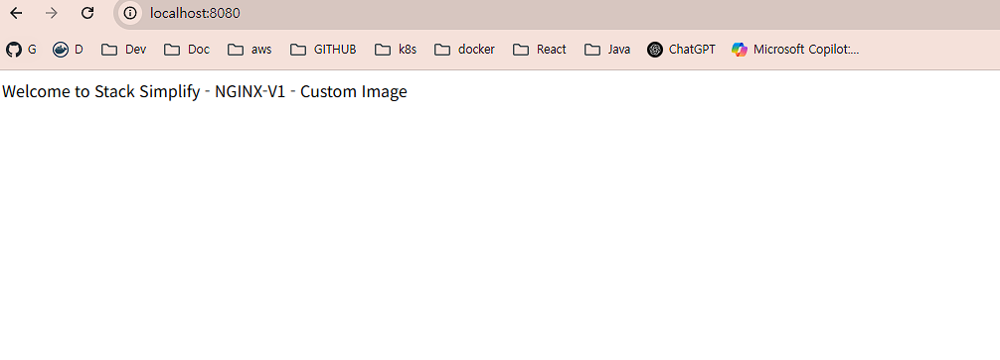


## docker hub 에서 중요한 이미지 가져오기 - latest 버젼으로
https://hub.docker.com/r/gitlab/gitlab-ce
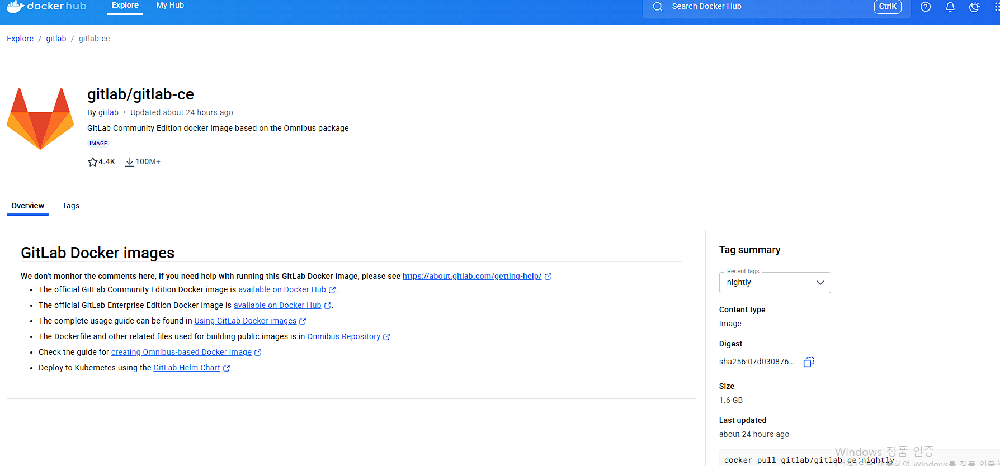
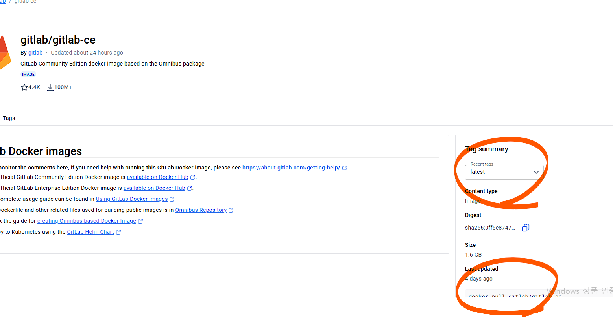

## docker pull gitlab/gitlab-ce

## 현재 컨테이너 중지 및 본인 실행중인 데몬의 포트 충돌 나는지 확인 필요
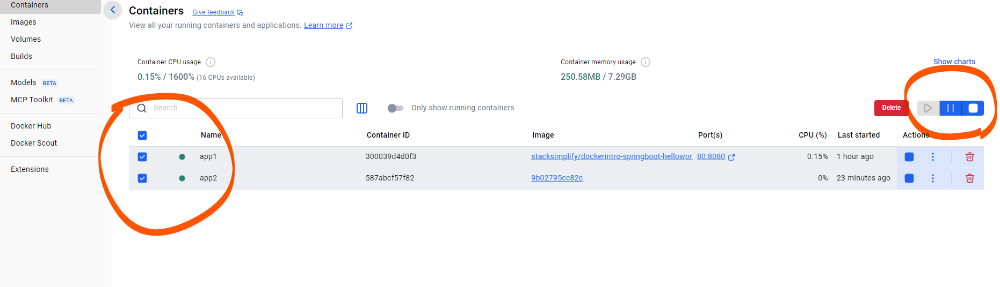
docker run --detach `
  --publish 80:80 --publish 443:443 --publish 22:22 `
  --name gitlab `
  --restart always `
  --volume $PWD/gitlab/config:/etc/gitlab `
  --volume $PWD/gitlab/logs:/var/log/gitlab `
  --volume $PWD/gitlab/data:/var/opt/gitlab `
  0ff5c87470e5033e77c6af20613d2ad050ed7155718ee35bc013196f1621dba5

## container 실행 시간 5분 이상 소요

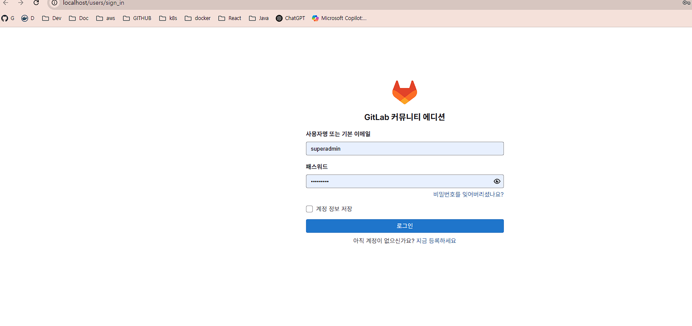

## 처음 접속 방법
docker exec -it gitlab grep 'Password:' /etc/gitlab/initial_root_password

PS C:\edumgt-java-education\docker-fundamentals> docker exec -it gitlab grep 'Password:' /etc/gitlab/initial_root_password
Password: MUYGthXqvJDomV0fGJZ/hYRv1ZySWlUNg5FGBsheJaw=

## 혹시 아래 화면이면 home 클릭
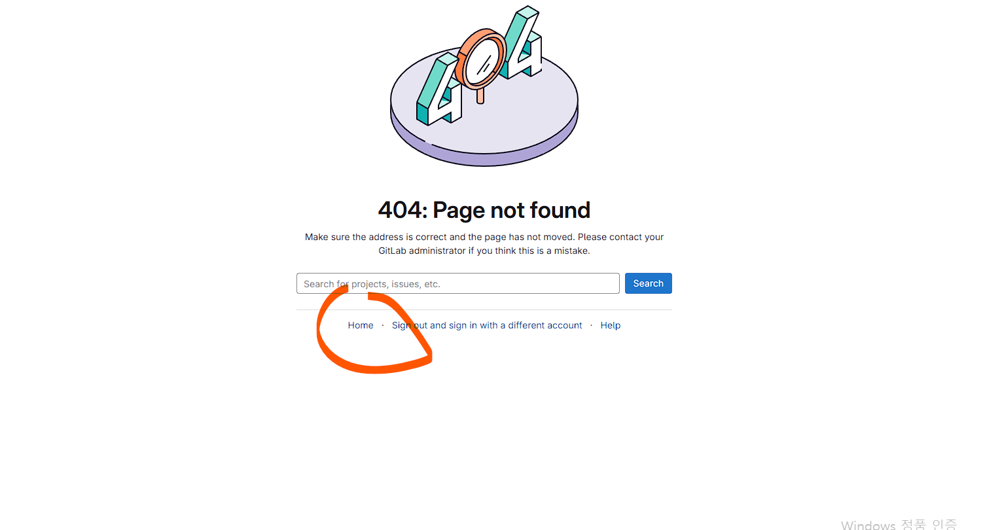
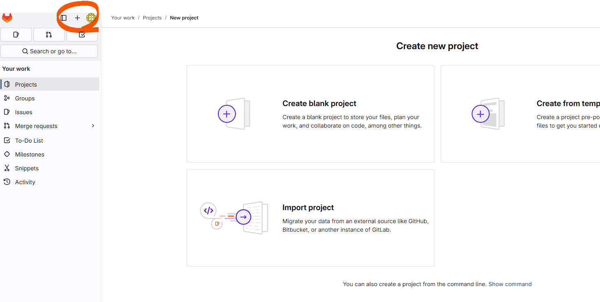
## New Repo 생성

## Step-3: Build Docker Image & run it
```
docker build -t stacksimplify/mynginx_image1:v1 .
docker run --name mynginx1 -p 80:80 -d stacksimplify/mynginx_image1:v1

Replace your docker hub account Id
docker build -t <your-docker-hub-id>/mynginx_image1:v1 .
docker run --name mynginx1 -p 80:80 -d <your-docker-hub-id>/mynginx_image1:v1
```

## Step-4: Tag & push the Docker image to docker hub
```
docker images
docker tag stacksimplify/mynginx_image1:v1 stacksimplify/mynginx_image1:v1-release
docker push stacksimplify/mynginx_image1:v1-release

Replace your docker hub account Id
docker tag <your-docker-hub-id>/mynginx_image1:v1 <your-docker-hub-id>/mynginx_image1:v1-release
docker push <your-docker-hub-id>/mynginx_image1:v1-release
```
## Step-5: Verify the same on docker hub
- Login to docker hub and verify the image we have pushed
- Url: https://hub.docker.com/repositories

## 지금까지의 과정과 동일한데, 단지 AWS 환경의 차이만 있음
## ECR 작업
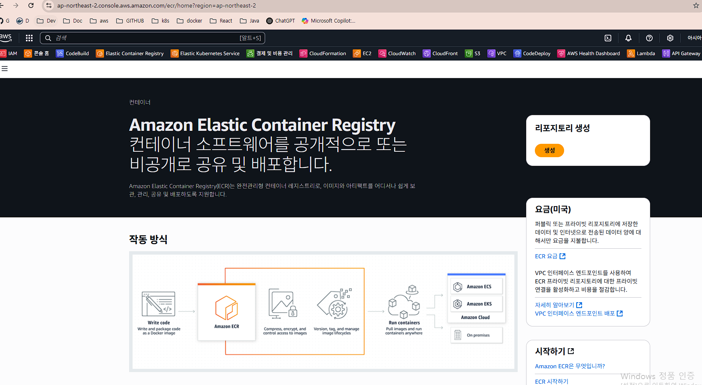
## 아래는 Docker Hub 와 동일
https://gallery.ecr.aws/

## ECR 생성
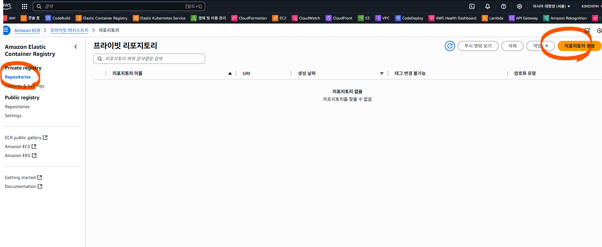
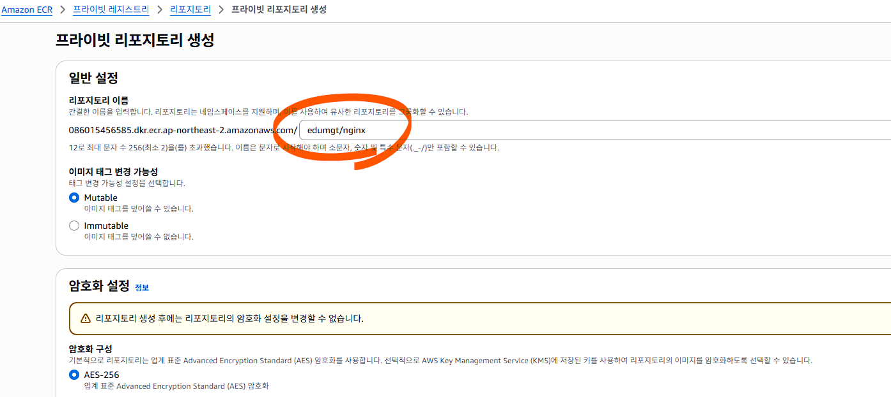
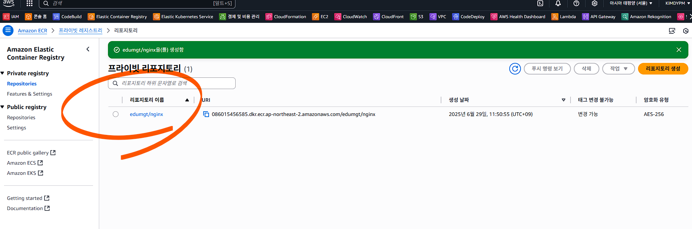

## ECR 에 push
ECR(Amazon Elastic Container Registry)에 생성한 private repository에 로컬 Docker 이미지를 push하는 전체 절차는 다음과 같습니다.

## 전제 조건
1. AWS CLI 설치 및 aws configure 완료
2. ECR에 private repository 생성 완료 (my-ecr-repo 등)
3. 로컬에 Docker 이미지 존재 (my-app:latest 등)

## aws ecr get-login-password --region ap-northeast-2 | docker login --username AWS --password-stdin <account_id>.dkr.ecr.ap-northeast-2.amazonaws.com

## 혹시 권한 IAM 문제 발생 시 각자 에러로그 분석해서 IAM 지정 필요
PS C:\edumgt-java-education\docker-fundamentals> aws ecr get-login-password --region ap-northeast-2 | docker login --username AWS --password-stdin 086015456585.dkr.ecr.ap-northeast-2.amazonaws.com
## 결과
Login Succeeded

## ECR에 푸시할 이미지 태깅 - 아직 push 가 아닙니다.
## docker tag 9b02795cc82cbf635af6325c51c65b1bbc9eefe2926398fd27b19d482557b14b 086015456585.dkr.ecr.ap-northeast-2.amazonaws.com/edumgt/nginx
## 위의 명령을 하기 위해 AWS repo 주소 복제
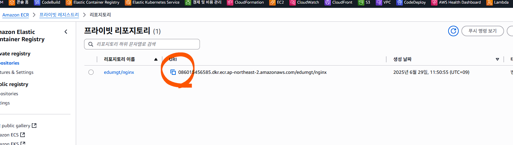

## 태깅 결과 


## ECR 로 푸시
docker push 086015456585.dkr.ecr.ap-northeast-2.amazonaws.com/edumgt/nginx

PS C:\edumgt-java-education\docker-fundamentals> docker push 086015456585.dkr.ecr.ap-northeast-2.amazonaws.com/edumgt/nginx
Using default tag: latest
The push refers to repository [086015456585.dkr.ecr.ap-northeast-2.amazonaws.com/edumgt/nginx]
71a22e73ef26: Waiting
021db26e13de: Waiting
dad67da3f26b: Waiting
397cc88dcd41: Waiting
5f4a88bd8474: Waiting
ee11c21378de: Waiting
4eb3a9835b30: Waiting
66467f827546: Waiting
f05e87039331: Waiting
error from registry: User: arn:aws:iam::086015456585:user/DevUser0002 is not authorized to perform: ecr:InitiateLayerUpload on resource: arn:aws:ecr:ap-northeast-2:086015456585:repository/edumgt/nginx because no identity-based policy allows the ecr:InitiateLayerUpload action

## Error
error from registry: User: arn:aws:iam::086015456585:user/DevUser0002 is not authorized to perform: ecr:InitiateLayerUpload on resource: arn:aws:ecr:ap-northeast-2:086015456585:repository/edumgt/nginx because no identity-based policy allows the ecr:InitiateLayerUpload action

## 권한 부여
aws iam attach-user-policy `
  --user-name DevUser0002 `
  --policy-arn arn:aws:iam::aws:policy/AmazonEC2ContainerRegistryPowerUser

## Error
PS C:\edumgt-java-education\docker-fundamentals> aws iam attach-user-policy `
>>   --user-name DevUser0002 `
>>   --policy-arn arn:aws:iam::aws:policy/AmazonEC2ContainerRegistryPowerUser

An error occurred (AccessDenied) when calling the AttachUserPolicy operation: User: arn:aws:iam::086015456585:user/DevUser0002 is not authorized to perform: iam:AttachUserPolicy on resource: user DevUser0002 because no identity-based policy allows the iam:AttachUserPolicy action

## IAM 콘솔에서 부여
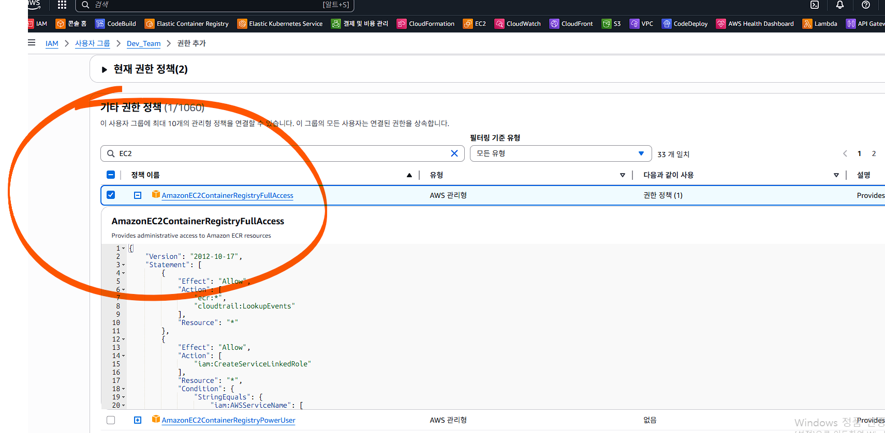
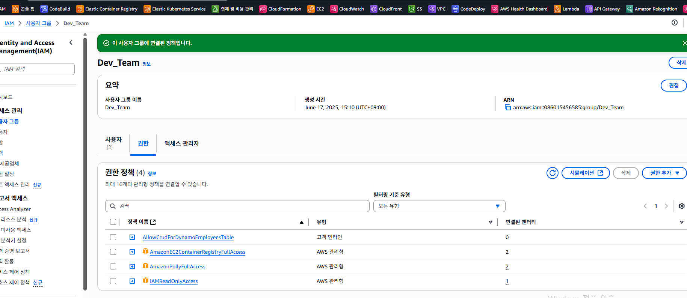

## 권한 문제 이상 없으면 다시 docker push
docker push 086015456585.dkr.ecr.ap-northeast-2.amazonaws.com/edumgt/nginx
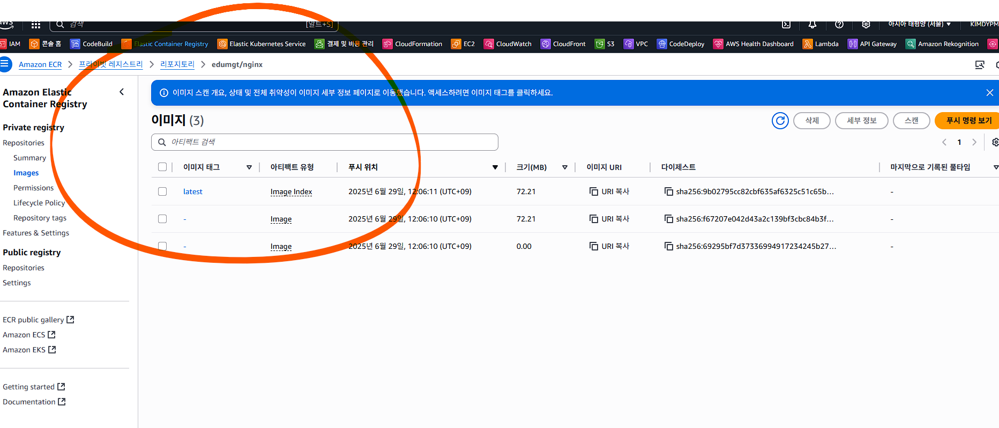
