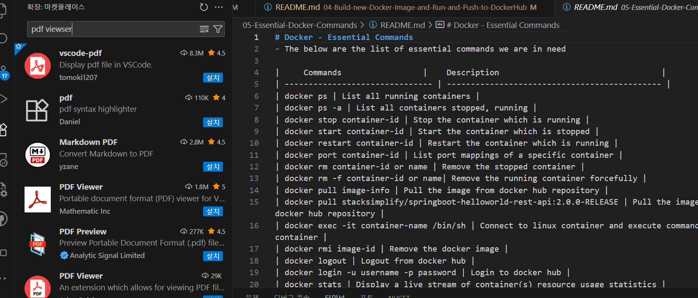

## VS Code PDF 뷰어 설치

# Docker - 핵심 명령어
- 아래는 자주 사용하는 핵심 명령어 목록입니다.

| 명령어 | 설명 |
| --- | --- |
| docker ps | 실행 중인 컨테이너 목록 보기 |
| docker ps -a | 중지/실행 중인 전체 컨테이너 목록 보기 |
| docker stop container-id | 실행 중인 컨테이너 중지 |
| docker start container-id | 중지된 컨테이너 시작 |
| docker restart container-id | 실행 중인 컨테이너 재시작 |
| docker port container-id | 특정 컨테이너의 포트 매핑 확인 |
| docker rm container-id or name | 중지된 컨테이너 삭제 |
| docker rm -f container-id or name | 실행 중인 컨테이너 강제 삭제 |
| docker pull image-info | Docker Hub에서 이미지 Pull |
| docker pull stacksimplify/springboot-helloworld-rest-api:2.0.0-RELEASE | Docker Hub에서 이미지 Pull(예시) |
| docker exec -it container-name /bin/sh | 컨테이너에 접속해 명령 실행 |
| docker rmi image-id | Docker 이미지 삭제 |
| docker logout | Docker Hub 로그아웃 |
| docker login -u username -p password | Docker Hub 로그인 |
| docker stats | 컨테이너 리소스 사용량 실시간 확인 |
| docker top container-id or name | 컨테이너에서 실행 중인 프로세스 확인 |
| docker version | Docker 버전 정보 확인 |
